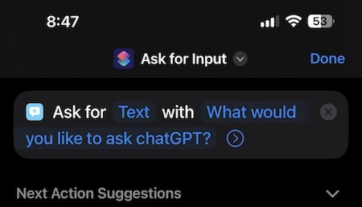
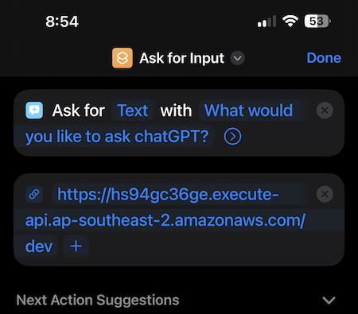
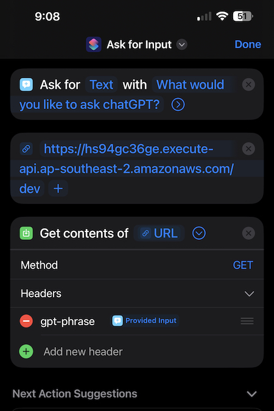
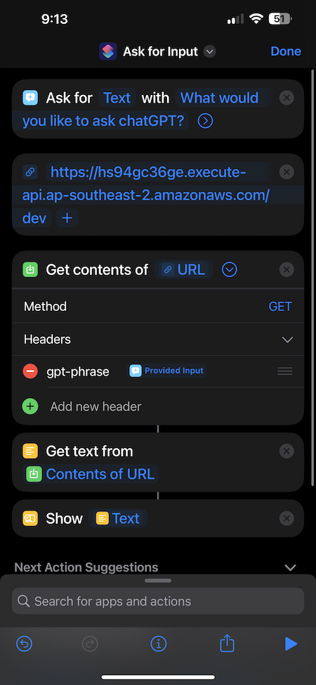

# __ChatGPT-Siri Introduction__

This program provides integration between Siri and ChatGPT. It allows you to ask Siri a question and have ChatGPT answer it - which Siri will read out.

## _Operation Steps_  
  
- You invoke the Siri shortcut through a phrase. eg "Hey Siri, start chatGPT"
- Siri will ask for a phrase to send to ChatGPT.
- The shortcut will send the question to an AWS API Gateway endpoint.  
- The API gateway will trigger a Lambda function. The Lambda function will send the question to the OpenAI API with ChatGPT as the AI model used.  
- The API will return an answer. The Lambda function will send ChatGPT's response back to the shortcut.  
- The response will then be read out by Siri.  

# __Set up__

There are 2 parts to the set up.
1. Set up the AWS resources. The AWS resources are created automatically through Terraform.
2. Set up the Siri shortcut. The Siri shortcut is created through the iOS shortcut.

## __AWS resources__

All the AWS resources are created automatically through Terraform.
Ensure Terraform is installed, and that CLI access to your desired AWS account is configured with your credentials.

Modify the lambda_app.py file to include your OpenAI API key and OpenAI orginization name.
These 2 values can be found:

- https://platform.openai.com/account/org-settings
- https://platform.openai.com/account/api-keys

Initialise Terraform:
```
> terraform init
```
  
Deploy the AWS resources, run:
```
> terraform apply
```
  
This will create the following resources:
- A lambda function
- An IAM role for the lambda function
- An IAM policy for the lambda function
- An API Gateway 

This will output the API Gateway endpoint. This is the endpoint that the Siri shortcut app in the next section will send the question to.

## __Siri shortcut app__

The Siri shortcut app is created through the iOS shortcut app.

1. Open the iOS shortcut app.
2. Tap the "+" button in the top right corner.
3. Tap "Add Action".
4. Search for "Ask for" and under the `Scripting` category select `Ask for Input`.
5. Under `Prompt` enter whatever you would like Siri to say when the shortcut is triggered. eg "What would you like to ask chatGPT".

<br>



<br>

6. Add a new action by typing in the search bar at the bottom of the screen - search for "Url". Select `Url` under the `Web` category.
7. In the `Url` field enter the API Gateway endpoint that was output when the AWS resources were created. For example `https://5jsydgfs.execute-api.ap-southeast-2.amazonaws.com/dev`.

<br>



<br>

8. Add a new action. Under the `Web` section select `Get Contents of Url`.
9. Expand the `Get Contents of Url` action with the `>` icon.
10. The method should be `GET`. Leave this as is.
11. Expand the `Headers` section. Add a new header.
- The header key is `gpt-phrase` (this must be copied exactly)
- The value is the variable `Provided Input` from the first step. The variable is selected at the top of the keyboard.

<br>



<br>

12. Add a new action. Under the `Documents` section select `Get Text From Input`. 
- This will automatically fill into "Get text from `Contents of URL`"
13. Add a new action. Under the `Documents` section select `Show Result`. 
- This will automatically fill into "Show `Text`".

<br>



<br>

14. Select "Done" up the top. The shortcut is now finished.
15. Finally hold down on the shortcut app and select "Rename". The name of the shortcut is what Siri will use to trigger the shortcut app. eg "start chat". "Hey Siri, `start chat'`

<br>

The shortcut app is now complete. To test it, trigger the shortcut app through Siri. eg "Hey Siri, start chat". Siri will ask for a phrase to send to chatGPT. Say a phrase and Siri will read out chatGPT's response.

# __Limitations__

Siri will time out after 30 seconds. This means that if the response from chatGPT takes longer than 30 seconds, the shortcut will stop and the response will not be read out.

ORG AND KEY